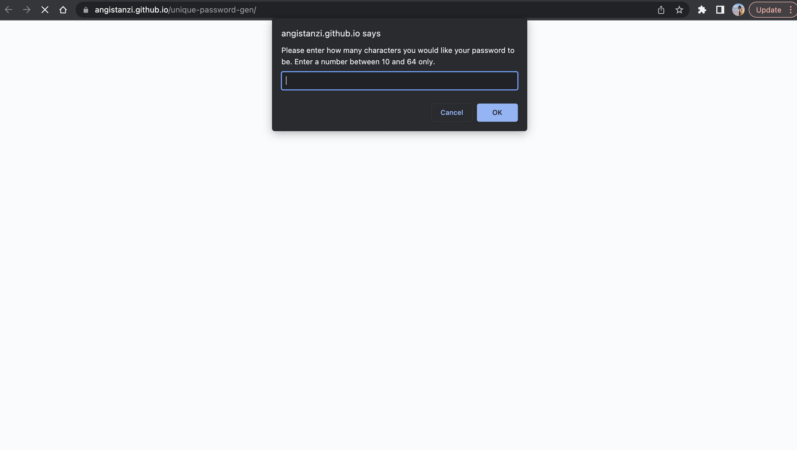

# Unique Password Generator

## Overview
 
This web application generates a random password when the "Generate Password" button is clicked. The user is asked a series of three questions about how long they want their password to be, and whether or not they would like numbers and special characters. 

<b>You can access the password generator here:</b> https://angistanzi.github.io/unique-password-gen/

## Upon loading, the page should appear with prompts:

## The webpage looks like the following image once the prompts have been answered:

